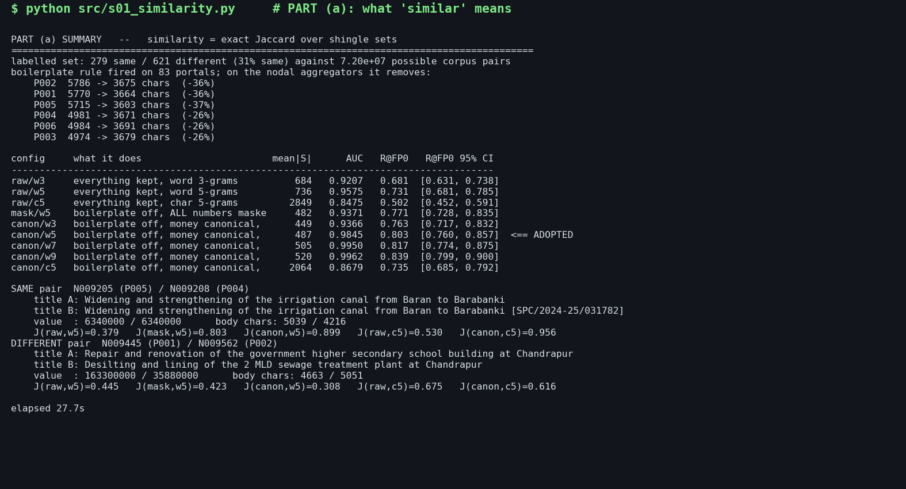
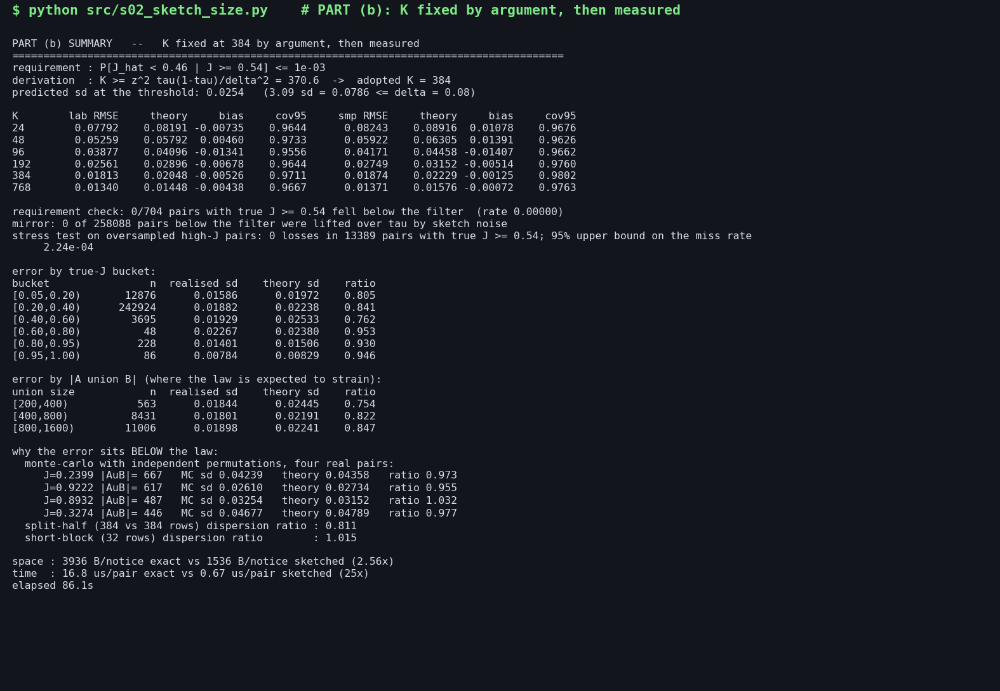
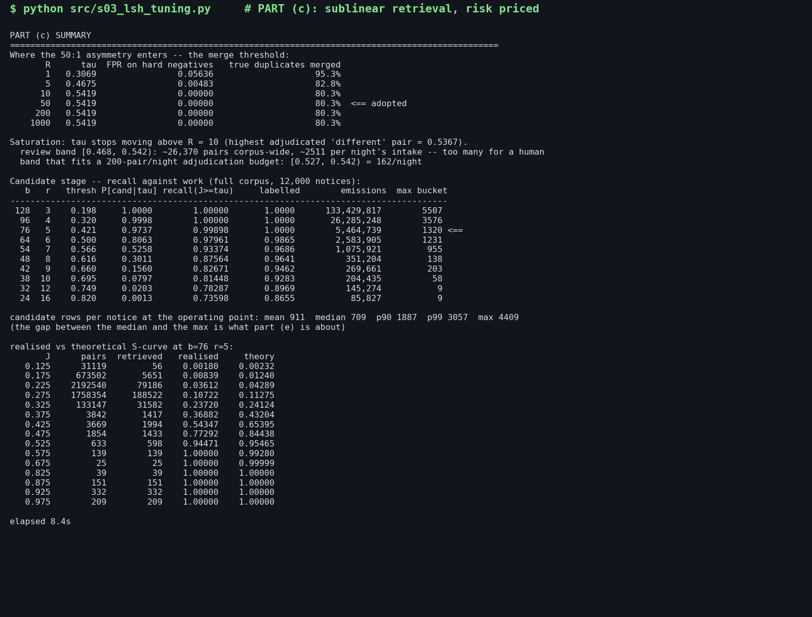
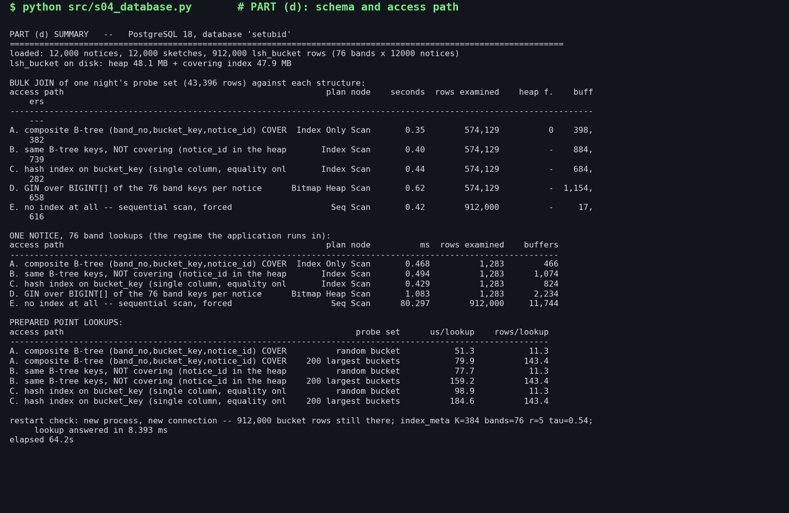
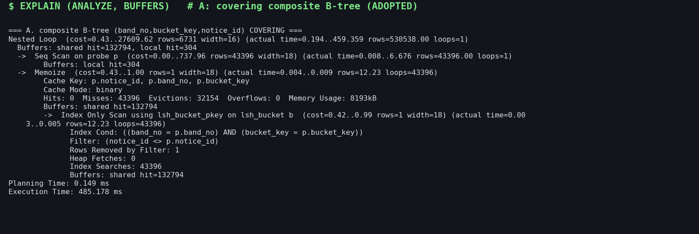
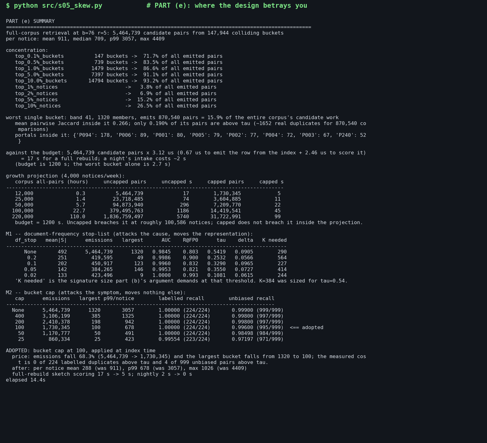
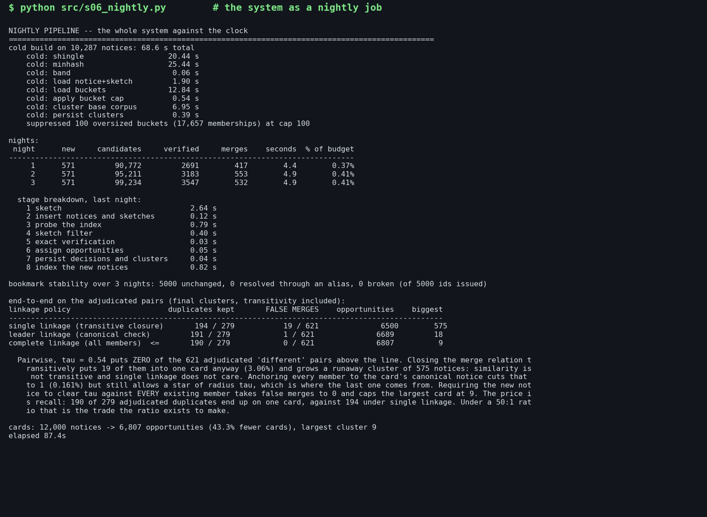

# Twelve thousand tenders, wearing disguise

**SetuBid near-duplicate detection — design, measurements and the judgment behind both**

Corpus: `data_2/` — 12,000 notices, 260 portals, 900 adjudicated pairs.
Everything below was measured on that corpus. Every number in this report is
reproduced by `python src/run_all.py`; the raw output is in `logs/`, the
machine-readable results in `results/*.json`.

---

## 0. What was built, and whether it works

| | |
|---|---|
| **Similarity** | exact Jaccard over the set of **word 5-grams** of a normalised notice |
| **Normalisation** | learned per-portal boilerplate removed; reference numbers and dates masked; **monetary amounts canonicalised to their value** |
| **Reduced form** | **K = 384**-row MinHash signature, 1,536 bytes/notice |
| **Retrieval** | banded LSH, **b = 76 bands of r = 5 rows**, buckets capped at **100** members |
| **Home** | PostgreSQL 18, `lsh_bucket` with a **covering composite B-tree** `(band_no, bucket_key, notice_id)` |
| **Merge rule** | candidate → sketch filter at 0.46 → exact Jaccard → merge iff **J ≥ τ = 0.54** → **complete-linkage** cluster |
| **Asymmetry** | **R = cost(false merge)/cost(missed merge) = 50**, entering at τ and at the linkage policy |

**Headline results**

| Requirement | Result |
|---|---|
| Nightly job inside 20 minutes | **4.9 s** for one night's 571 notices — 0.41 % of the budget |
| Full cold rebuild | **68.6 s** for 10,287 notices |
| Retrieval recall on pairs with J ≥ τ (unbiased, 4.8 M pairs) | **0.996** |
| False merges on the 621 adjudicated `different` pairs | **0 / 621**, transitivity included |
| Duplicates caught, end to end | **190 / 279** adjudicated `same` pairs on one card |
| Bookmarks surviving 3 re-runs | **5,000 / 5,000** |
| Cards | 12,000 notices → **6,807 opportunities** (43.3 % fewer cards) |

The one number that should worry the board is not in this table: uncapped, the
candidate stage breaches the 20-minute budget at roughly **100,000 notices**,
about five months of growth. Part (e) is about that.

---

## 1. Before anything else: how the labels are skewed

`labelled_pairs.csv` is **279 same / 621 different — 31 % positive**. The corpus
has 7.20 × 10⁷ possible pairs. Whatever the true duplicate rate is, it is
several orders of magnitude below 31 %. Two consequences run through the whole
design:

1. **Rates transfer, counts do not.** TPR and FPR measured on this sample are
   usable. Precision, and any statement of the form "we will make *n* false
   merges a night", is not — it has to be re-derived by multiplying a rate by
   the real number of candidate pairs. Part (c) does that explicitly.
2. **The negatives are hard negatives.** A pair reached a human because
   something made it look alike. So FPR measured here is *pessimistic* relative
   to a randomly drawn non-duplicate pair. Given that a false merge is the
   expensive error, being pessimistic is the right direction to be wrong in,
   and I have used these negatives as the FPR estimator throughout without
   correction.

A third consequence is quieter and cost me a working day: a threshold tuned
against 621 negatives saturates. Once τ sits above the highest-scoring negative,
no further increase in the cost ratio changes anything the data can see. See
§4.3.

---

## 2. Part (a) — what "similar" means, mechanically

### 2.1 The commitment

A notice becomes a **set of 64-bit hashes of word 5-grams** drawn from a
normalised rendering of `title + "\n" + body`. The similarity of two notices is
the **Jaccard coefficient** of those two sets:

$$J(A,B) = \frac{|A \cap B|}{|A \cup B|}$$

Everything downstream — the sketch, the bands, the threshold, the clustering —
is defined with respect to that one number, so there is exactly one place in the
system where "similar" is decided.

Implementation: `src/common.py`, `normalise()` and `shingle()`.

### 2.2 Decision 1 — how finely the text is decomposed

Nine combinations were scored on all 900 adjudicated pairs
(`logs/s01_similarity.log`, `figures/a_score_distributions.png`):

| config | mean \|S\| | AUC | recall at **zero** false merges | 95 % CI |
|---|---:|---:|---:|---|
| raw / word-3 | 684 | 0.9207 | 0.681 | [0.631, 0.738] |
| raw / word-5 | 736 | 0.9575 | 0.731 | [0.681, 0.785] |
| raw / char-5 | 2849 | 0.8475 | 0.502 | [0.452, 0.591] |
| mask / word-5 | 482 | 0.9371 | 0.771 | [0.728, 0.835] |
| canon / word-3 | 449 | 0.9366 | 0.763 | [0.717, 0.832] |
| **canon / word-5** | **487** | **0.9845** | **0.803** | **[0.760, 0.857]** |
| canon / word-7 | 505 | 0.9950 | 0.817 | [0.774, 0.875] |
| canon / word-9 | 520 | 0.9962 | 0.839 | [0.799, 0.900] |
| canon / char-5 | 2064 | 0.8679 | 0.735 | [0.685, 0.792] |

*Recall at zero false merges* — the share of `same` pairs scoring above **every**
`different` pair — is the metric the stated asymmetry asks for. It is the
recall available in the region where no adjudicated negative can reach us.

**Character 5-grams are rejected on evidence.** They separate *worse*
(AUC 0.868 vs 0.985) while producing **4.2× the shingles**, which multiplies
sketching cost by the same factor. The reason is visible in the walkthrough
below: character n-grams score on shared orthography, and every notice in this
corpus shares its orthography with every other one.

**Word 9-grams are better on this sample and were still not adopted.** A paired
test is decisive about the direction and honest about its size: moving from
5-grams to 9-grams pushes `different` pairs down by 0.102 on average while
pushing `same` pairs down by only 0.024, so the separation gain is real. But the
bootstrap intervals on recall-at-zero-false-merges overlap heavily
([0.760, 0.857] vs [0.799, 0.900]), and longer n-grams drag the **true-duplicate
median from 0.903 to 0.871** and the 5th percentile from 0.307 to 0.278
(`figures/a_granularity_tradeoff.png`). Every point of true-duplicate similarity
lost has to be bought back at the retrieval stage with more bands — and part (e)
shows candidate volume, not scoring accuracy, is the term that threatens the
budget. I took the smallest k whose separation is statistically indistinguishable
from the best.

### 2.3 Decision 2 — what is signal and what is noise

The corpus contains monetary amounts, dates, reference numbers and portal
boilerplate. My rulings:

| element | ruling | why |
|---|---|---|
| **portal boilerplate** | **removed**, by a rule learned from the corpus | it is constant within a portal, so it cannot separate two notices *from* that portal, and across portals it actively manufactures similarity |
| **reference numbers** | **masked** to `<ref>` | the scraping notes say the same tender carries three unrelated reference numbers on three portals, and there is no cross-walk. Pure noise |
| **dates inside the body** | **masked** to `<date>` | nodal agencies re-publish weeks later and corrigenda carry new closing dates; the same opportunity legitimately has different dates |
| **monetary amounts** | **canonicalised to their value**, not masked | this is the decision the rest turned on — see below |
| other numbers | masked to `<num>` | quantities and chainages are formatted inconsistently and carry little cross-portal signal |

Boilerplate detection is **learned, not hard-coded**: a line whose normalised
form repeats verbatim in more than 60 % of a portal's notices (portals with
≥ 20 notices, lines ≥ 25 characters) is template. The rule fires on **83
portals** and removes 26–37 % of the text on the six nodal aggregators — which
is exactly the ~1,400-character preamble the scraping team described, found
without being told it exists.

> An earlier version of the line key normalised digits away. It removed
> `Estimated cost put to tender: Rs. 7,60,00,000/-` from every notice on the
> portal, because with digits blanked that line *is* constant — deleting the
> single most discriminating line in the document. The line key is now
> digit-sensitive. This is recorded because it is the kind of bug that produces
> a working system with quietly worse numbers.

**Money: canonicalised, not masked.** `Rs. 4,50,00,000/-`, `Rs. 450.00 lakh`,
`INR 4.500 Cr` and `45000000` all become the token `<money_45e6>` (three
significant figures). The *format* is noise; the *amount* is the most
discriminating field in a procurement notice. The three-way ladder proves it:

| normalisation (word-5) | AUC | recall at zero FP |
|---|---:|---:|
| raw — keep everything | 0.9575 | 0.731 |
| mask — boilerplate off, **all** numbers masked | 0.9371 | 0.771 |
| **canon — boilerplate off, money canonicalised** | **0.9845** | **0.803** |

Masking money *lowers* AUC below raw. Canonicalising it beats both. Across the
279 `same` pairs, canonicalisation lifts 220 by more than 0.02 and hurts 10.

### 2.4 The two-pair walkthrough



**A pair adjudicated `same`** — N009205 (P005) and N009208 (P004), the same
canal-widening tender re-published by two nodal aggregators, both at
₹63,40,000, bodies 5,039 and 4,216 characters:

| | J |
|---|---:|
| raw, word-5 | **0.379** |
| mask, word-5 | 0.803 |
| **canon, word-5** | **0.899** |
| raw, char-5 | 0.530 |

**A pair adjudicated `different`** — N009445 (P001), a school repair at
₹16.33 crore, and N009562 (P002), a sewage treatment plant at ₹3.59 crore. Both
nodal, both from the same town:

| | J |
|---|---:|
| raw, word-5 | **0.445** |
| mask, word-5 | 0.423 |
| **canon, word-5** | **0.308** |
| raw, char-5 | 0.675 |

**Under the raw representation the different pair scores higher than the same
pair (0.445 > 0.379).** No threshold on raw text can separate these two. Under
the adopted representation they are 0.899 and 0.308 — either side of any
sensible line. Character 5-grams make it worse still (0.675 for the pair that
must not merge).

### 2.5 What adopting it cost

- **A maintained template table.** Boilerplate is learned from corpus
  statistics, so it must be re-learned as portals change their furniture.
  Cost measured: 4.4 s over 12,000 notices, and it is a whole-corpus operation,
  not an incremental one.
- **Regex surface.** The money canonicaliser is five patterns. A portal that
  invents a sixth format silently degrades to `<num>` — a miss, not a false
  merge, which is the cheap failure.
- **A capability deliberately given up.** With refs and dates masked, the
  representation *cannot tell a corrigendum from its parent*. For this product
  that is correct behaviour — they are the same opportunity — but it means the
  representation can never be reused to detect amendments.
- **Sensitivity to short notices.** On heavily truncated notices the shingle
  set shrinks and J is bounded by the length ratio regardless of content.

---

## 3. Part (b) — the size of the reduced form, fixed before it was built

### 3.1 The argument, written before the code

The full derivation is the module docstring of `src/s02_sketch_size.py` and was
not edited afterwards. In summary:

**Reduced form.** A K-row MinHash signature. Row *i* is `min over s in S(X) of
h_i(s)`. The estimator `Ĵ = (1/K)·#{i : sig_i(A) = sig_i(B)}` is unbiased with
variance `J(1−J)/K`.

**The accuracy the application needs.** The merge decision is *not* taken on the
sketch. The pipeline is

```
LSH candidates → sketch filter at (τ − δ) → exact Jaccard recomputed from the
stored body → merge iff exact J ≥ τ
```

That is a deliberate architectural choice and it is what lets K stay small: a
sketch error can never on its own cause a false merge, the expensive failure.
The sketch is only required not to *lose* a true duplicate:

> P[ Ĵ < τ − δ | true J ≥ τ ] ≤ ε

**The numbers.** τ = 0.54 (part (c)'s cost-optimal threshold). ε = 10⁻³, one
tenth of the 10⁻² miss budget allocated to the LSH stage — a component that is
not the binding loss should sit an order of magnitude below the one that is.
δ = 0.08, chosen so the whole overlap band of the labelled data (negatives'
99th percentile 0.451 → τ 0.542) sits *inside* the filter; δ is a pure cost
knob, trading K against extra exact verifications.

$$K \ge \frac{z_\varepsilon^2\,\tau(1-\tau)}{\delta^2} = \frac{3.0902^2 \times 0.2484}{0.0064} = 370.6$$

**K = 384** — the smallest size above the requirement that factorises usefully
for banding (384 = 2⁷·3, so r ∈ {3,4,6,8,12,16,24,32} all divide it and no
signature row is wasted). 384 rows × 4 bytes = **1,536 bytes per notice**:
18 MB for today's corpus, ~320 MB after four years of growth.

### 3.2 What the measurement said



Measured on the 900 labelled pairs and on 259,857 sampled pairs with exact
Jaccard computed for every one:

| K | labelled RMSE | theory | sampled RMSE | theory | 95 % coverage |
|---:|---:|---:|---:|---:|---:|
| 24 | 0.0779 | 0.0819 | 0.0824 | 0.0892 | 0.968 |
| 48 | 0.0526 | 0.0579 | 0.0592 | 0.0631 | 0.963 |
| 96 | 0.0388 | 0.0410 | 0.0417 | 0.0446 | 0.966 |
| 192 | 0.0256 | 0.0290 | 0.0275 | 0.0315 | 0.976 |
| **384** | **0.0181** | **0.0205** | **0.0187** | **0.0223** | **0.980** |
| 768 | 0.0134 | 0.0145 | 0.0137 | 0.0158 | 0.976 |

**The requirement is met.** Random sampling barely produces pairs above τ, so
they were oversampled deliberately with a tight banding: **0 losses in 13,389
pairs with true J ≥ 0.54**, which bounds the miss rate at **2.24 × 10⁻⁴** with
95 % confidence — below the 10⁻³ the argument demanded. In the mirror direction,
0 of 258,088 pairs below the filter were lifted over τ by sketch noise.

Space and speed, measured: **3,936 → 1,536 bytes per notice (2.56×)** and
**17.7 µs → 0.72 µs per pair comparison (24×)**. The byte saving is the less
interesting half. The important property is that a signature is *fixed-width*:
an exact shingle set is variable-length (a 9,000-character notice carries three
times the postings of a 1,500-character one) and cannot be banded at all.

### 3.3 Where it did **not** behave as predicted

The scaling is right — a log-log fit gives slope **−0.529** against a
theoretical −0.5. The **magnitude is not**: realised error sits **8–15 % below**
the binomial prediction at every K, on both samples, and the 95 % intervals
over-cover (0.98 rather than 0.95). Error is uniformly under-dispersed, worst on
small unions (ratio 0.754 for |A ∪ B| < 400).

That is an estimator behaving *better* than its own theory, which deserved an
explanation rather than a shrug. Three measurements, in `figures/b_error_structure.png`:

1. **Monte-Carlo of the law itself.** For four real pairs, draw genuinely
   independent random permutations of A ∪ B and measure the dispersion of Ĵ over
   400 replications. Ratios to theory: 0.973, 0.955, 1.032, 0.977. **The law is
   right.** The deviation belongs to the hash family we ship, not to MinHash.
2. **Short-range dispersion** over 24 disjoint blocks of 32 rows: ratio **1.015**
   — binomial, exactly as predicted.
3. **Long-range dispersion**, first 384 rows against last 384: ratio **0.811**.

So the rows are locally independent and very slightly negatively correlated at
long range. Chasing it further: the effect survives a switch to a mixed-seed
family and to a keyed BLAKE2b family, so it is not an artefact of the particular
mixing function.

**K = 384 was retained.** Re-deriving K from the realised error would shrink it
by about 25 %. The deviation is in the safe direction and is not fully
explained, so the margin is banked rather than spent — a saving of 380 bytes per
notice is not worth spending an unexplained result on.

---

## 4. Part (c) — sublinear retrieval, with the risk priced

### 4.1 The structure

The K = 384 signature is cut into **b bands of r rows**; two notices are
candidates if any band matches exactly. The probability a pair survives to the
candidate list is the S-curve

$$P[\text{candidate} \mid J] = 1 - (1 - J^{r})^{b}$$



### 4.2 Measuring the S-curve without fooling myself

The obvious way to get pairs spanning the similarity range is to run a generous
LSH pass and sample its output. **That is wrong, and it produced a wrong figure
in an earlier draft**: every pair in such a sample was selected *by* a band
collision, so measured P[candidate | J] is biased upward exactly at low J, where
the work comes from. The first version overstated retrieval at J ≈ 0.22 by 2.4×.

The measurement was rebuilt on an **unbiased anchor sample**: 400 notices drawn
at random and scored with exact Jaccard against **all 12,000** — 4.8 million
pairs, no sampler in the loop. (This is affordable because of a posting-list
index over shingle values, `common.PostingIndex`: one notice against the whole
corpus in 23 ms, verified identical to brute force.)

Realised against theory at the operating point:

| true J | pairs | retrieved | realised | theory |
|---:|---:|---:|---:|---:|
| 0.125 | 31,119 | 56 | 0.0018 | 0.0023 |
| 0.225 | 2,192,540 | 79,186 | 0.0361 | 0.0429 |
| 0.275 | 1,758,354 | 188,522 | 0.1072 | 0.1128 |
| 0.375 | 3,842 | 1,417 | 0.3688 | 0.4320 |
| 0.475 | 1,854 | 1,433 | 0.7729 | 0.8444 |
| 0.525 | 633 | 598 | 0.9447 | 0.9547 |
| 0.575 | 139 | 139 | 1.0000 | 0.9928 |
| ≥ 0.80 | 731 | 731 | 1.0000 | 1.0000 |

The curve tracks theory and sits slightly below it in the mid-range — the same
mild under-dispersion found in part (b), showing up in a second, independent
measurement.

Note the shape of the corpus in that table: **4.0 of the 4.8 million pairs sit
between J = 0.20 and 0.30.** Every notice in this corpus is a quarter similar to
every other one. That is the background against which retrieval has to work, and
it is the seed of part (e).

### 4.3 Where the 50:1 asymmetry enters — and where it does not

The head of product's two failure modes are not the same size. I recorded the
ratio as **R = 50**: one false merge (a missed deadline, a lawsuit, a lost
account) costs as much as fifty duplicate cards (a grumble). The ratio enters
the system in **two** places, and deliberately not in a third.

**It enters the merge threshold.** τ minimises `R·FPR + FNR` on the adjudicated
pairs:

| R | τ | FPR on hard negatives | true duplicates merged |
|---:|---:|---:|---:|
| 1 | 0.307 | 0.0564 | 95.3 % |
| 5 | 0.468 | 0.0048 | 82.8 % |
| 10 | 0.542 | 0.0000 | 80.3 % |
| **50** | **0.542** | **0.0000** | **80.3 %** |
| 200 | 0.542 | 0.0000 | 80.3 % |
| 1000 | 0.542 | 0.0000 | 80.3 % |

**It does not enter (b, r).** A spurious candidate cannot cause a false merge —
verification still has to clear it. A spurious candidate costs CPU. So the
candidate stage is a recall-versus-budget problem, not a recall-versus-risk one.
Tuning LSH "for the asymmetry" would spend compute buying precision at a stage
that is structurally incapable of producing the expensive error.

**It enters the linkage policy** — see §7. That turned out to be where it
mattered most, and it was not obvious in advance.

**Honest limitation: the threshold saturates.** Above R = 10, τ is pinned just
above the highest-scoring adjudicated negative (0.5367) and **the labelled set
contains no negative that moving τ could exclude**. R = 50 and R = 1000 are
indistinguishable on 621 negatives. What a large R actually buys is (i) the
decision to verify on exact Jaccard rather than on the sketch, (ii) complete
linkage over single linkage, and (iii) a review band. Quantified: pairs in
[0.468, 0.542) number ~26,370 corpus-wide and **2,511 per night's intake** —
far too many for a human. The band that fits a 200-pair/night adjudication
budget is **[0.527, 0.542), about 162 pairs a night**. That is where I would
spend the ratio, and it is how the labelled set grows.

**The count-level risk, with the skew corrected.** Zero of 621 negatives reach
τ, but zero events out of 621 only bounds FPR at **0.48 %** with 95 %
confidence. Applied naively to a night's ~450,000 candidate pairs that would
allow thousands of false merges. It does not, because those 621 are *hard*
negatives drawn from the adjudication queue, not random candidate pairs — but
the bound is the number to quote to the head of product, and it is the reason
the final decision is taken on exact Jaccard and the clustering is
complete-linkage.

### 4.4 The operating point

The recall floor is set one order of magnitude below the loss the threshold
already imposes (FNR at τ is 0.197), so retrieval is not the binding source of
misses: **require unbiased recall ≥ 0.99 on pairs with exact J ≥ τ, then take
the cheapest (b, r) that clears it.**

| b | r | LSH threshold | recall (J ≥ τ), unbiased | candidate pairs, full corpus | largest bucket |
|---:|---:|---:|---:|---:|---:|
| 128 | 3 | 0.198 | 1.00000 | 133,429,817 | 5,507 |
| 96 | 4 | 0.320 | 1.00000 | 26,285,248 | 3,576 |
| **76** | **5** | **0.421** | **0.99898** | **5,464,739** | **1,320** |
| 64 | 6 | 0.500 | 0.97961 | 2,583,905 | 1,231 |
| 54 | 7 | 0.566 | 0.93374 | 1,075,921 | 955 |
| 48 | 8 | 0.616 | 0.87564 | 351,204 | 138 |
| 32 | 12 | 0.749 | 0.78287 | 145,274 | 9 |
| 24 | 16 | 0.820 | 0.73598 | 85,827 | 9 |

**b = 76, r = 5.** `figures/c_recall_vs_work.png` makes the tension explicit: it
is the knee. Going one step cheaper (64×6) halves the work but drops recall to
0.980, below the floor; going one step richer (96×4) costs **4.8× the work** to
buy 0.001 of recall.

The operating point is marked on the S-curve plot in
`figures/c_s_curves.png`.

Candidate rows per notice at that point: mean 911, median 709, p90 1,887,
p99 3,057, **max 4,409**. The distance between that median and that max is the
subject of part (e).

---

## 5. Part (d) — a home and an access path

### 5.1 The schema

`src/schema.sql`. Four groups of tables:

```
notice(notice_id PK, portal_id, published_at, title, body, estimated_value, closing_date)

notice_sketch(notice_id PK → notice, k_rows, shingles, sig BYTEA, sketched_at)
      -- the reduced form of part (b): K little-endian uint32, fixed width

lsh_bucket(band_no SMALLINT, bucket_key BIGINT, notice_id TEXT,
           PRIMARY KEY (band_no, bucket_key, notice_id))
      -- the retrieval structure of part (c)
suppressed_bucket(band_no, bucket_key, members, suppressed_at)
      -- buckets refused by the cap, recorded rather than silently dropped

opportunity(opportunity_id PK, created_at, canonical_notice_id, member_count)
notice_opportunity(notice_id PK → notice, opportunity_id → opportunity, join_score)
opportunity_alias(alias_id PK, opportunity_id → opportunity, merged_at)
merge_decision(notice_id_a, notice_id_b, j_sketch, j_exact, decision, decided_at)

index_meta(k_rows, bands, rows_per_band, variant, scheme, tau, tau_sketch,
           bucket_cap, built_at)
      -- so a restarted process can tell whether the buckets on disk still mean
      -- what it thinks they mean
```

Nothing that matters lives in a Python object. `figures/d_storage.png` shows
what each structure costs on disk.

### 5.2 The one query, five physical ways to answer it

```sql
SELECT notice_id FROM lsh_bucket WHERE band_no = $1 AND bucket_key = $2
```

| | structure | how it physically locates rows |
|---|---|---|
| **A** | **composite B-tree, covering** — PK `(band_no, bucket_key, notice_id)` | descend the B-tree on the two equality columns, land on the first matching entry, walk the leaf forward while the key holds. `notice_id` is **in** the index, so the answer is complete without the heap |
| B | same keys, **not covering** — index on `(band_no, bucket_key)` | identical descent, then a random heap page visit per matching entry to fetch the one column wanted |
| C | **hash index** on `bucket_key` | single-column and equality-only by construction; no ordering, so no index-only scan is possible and every hit is a heap visit; cannot carry `band_no`, cannot serve ordered maintenance scans, cannot feed a merge join |
| D | **GIN** over `BIGINT[]` of all 76 band keys, one row per notice | posting-list probe → bitmap → heap recheck; the array carries no band position, so the structure cannot distinguish "key X in band 3" from "key X in band 47" |
| E | **no index** — sequential scan, forced | read the table |

### 5.3 The measurements



**Bulk regime** — one night's probe set (43,396 rows) joined against each
structure, `EXPLAIN (ANALYZE, BUFFERS)`:

| path | plan node | seconds | rows examined | heap fetches | buffers |
|---|---|---:|---:|---:|---:|
| **A** | **Index Only Scan** | **0.35** | 574,129 | **0** | **398,382** |
| B | Index Scan | 0.40 | 574,129 | — | 884,739 |
| C | Index Scan | 0.44 | 574,129 | — | 684,282 |
| D | Bitmap Heap Scan | 0.62 | 574,129 | — | 1,154,658 |
| E | Seq Scan (hash join) | 0.42 | 912,000 | — | 17,616 |

**Online regime** — one notice, 76 band lookups, the regime the application
actually runs in:

| path | plan node | ms | rows examined | buffers |
|---|---|---:|---:|---:|
| **A** | **Index Only Scan** | 0.47 | **1,283** | **466** |
| B | Index Scan | 0.49 | 1,283 | 1,074 |
| C | Index Scan | 0.43 | 1,283 | 824 |
| D | Bitmap Heap Scan | 1.08 | 1,283 | 2,234 |
| E | Seq Scan | **80.3** | **912,000** | 11,744 |

**Prepared point lookups**, 2,000 random buckets and the 200 largest:

| path | random bucket | 200 largest buckets |
|---|---:|---:|
| **A — covering B-tree** | **51 µs** | **80 µs** |
| B — non-covering | 78 µs | 159 µs |
| C — hash index | 99 µs | 185 µs |

The plans themselves are in `logs/d_plans.txt` and rendered as
`screenshots/07..10`:



`Heap Fetches: 0` is the whole argument for the third primary-key column.

### 5.4 Reading these numbers honestly

Three things should be said plainly rather than spun.

- **In the online regime A, B and C are within noise of each other on
  wall-clock** (0.43–0.49 ms). The entire 90 MB working set fits in the server's
  128 MB `shared_buffers`, so a heap fetch costs a memory reference. What
  separates them is **buffer traffic — 466 vs 1,074 vs 824 pages** — and that is
  the quantity that stops being free when the index outgrows RAM. The covering
  index halves it. The point-lookup timings, where the same work is repeated
  2,200 times, show the difference the single-shot timing hides.
- **The forced sequential scan is not catastrophic in the bulk regime** (0.42 s,
  and the fewest buffers of all) because the planner switches to a hash join and
  reads the table exactly once. That is a genuinely reasonable plan for a large
  batch. It is untenable for the other two reasons: it costs **80.3 ms and
  912,000 rows examined to answer a question about one notice** — 170× the index
  path — and its cost scales with the corpus rather than with the intake, which
  is the wrong direction for a system that must run "forever".
- **My bucket keys are salted with the band number**, so a single-column hash
  index happens to return nearly the right rows without the `band_no` recheck I
  predicted. The hash index loses on the properties that remain: no index-only
  scan, no ordering, no range or prefix access for maintenance.

### 5.5 It survives a restart

A new process and a new connection, with no warm Python state:
**912,000 bucket rows still present**, `index_meta` reporting K = 384, 76 bands
of 5, τ = 0.54, and the lookup answering. A live `psql` session is captured in
`screenshots/11_psql_session.png` — including a real card: one tender,
**nine portals, two of them corrigenda**, on one `opportunity_id`.

---

## 6. Part (e) — where the design betrays you

### 6.1 The concentration is in buckets, not notices



Full-corpus retrieval at b = 76, r = 5 emits **5,464,739 candidate pairs** from
147,944 colliding buckets. Looking at per-notice cost — the obvious thing to
look at — the corpus looks almost healthy:

| | share of all candidate work |
|---|---:|
| worst 1 % of notices | 3.8 % |
| worst 5 % of notices | 15.2 % |
| worst 10 % of notices | 26.5 % |

Looking at buckets instead:

| | buckets | share of all candidate work |
|---|---:|---:|
| **worst 0.1 %** | **147** | **71.7 %** |
| worst 1 % | 1,479 | 86.6 % |
| worst 10 % | 14,794 | 93.2 % |

**147 buckets out of 147,944 carry 72 % of the nightly cost.** The per-notice
view hides it completely, because the members of a monster bucket each carry
only their own share of it. `figures/e_work_distribution.png`.

The single worst bucket: band 41, **1,320 members**, emitting **870,540
candidate pairs — 15.9 % of the entire corpus's candidate work from one bucket
in one band**. Its members' mean pairwise Jaccard is **0.266**, and **0.19 %**
of its pairs are above τ. It is doing 870,540 comparisons to find roughly 1,650
duplicates.

Its membership is drawn from exactly where `portal_profiles.md` says to look —
P094 (178), then the six nodal aggregators (464 between them) — but the portal
attribution is a red herring, and `figures/e_portal_attribution.png` says so:
the nodal portals are **38.9 % of the corpus and 35.2 % of the work**, P094 is
**11.9 % of the corpus and 12.8 % of the work**. They are big, not
disproportionate. The concentration is a property of buckets, not of publishers.

### 6.2 Why this corpus does this to this design — mechanically

A MinHash row is the minimum of a hash over a notice's shingle set. A shingle
present in a large fraction of the corpus is a candidate for that minimum in
**every one of those notices at once**. So whenever such a shingle happens to
draw a small value under permutation *i*, thousands of notices receive the
*same* value in row *i*. A band is r = 5 consecutive rows; if all five are won
by corpus-wide shingles, every notice carrying them lands in one bucket.

The fuel is measurable. Of 306,726 distinct shingle types, only 0.79 % occur in
more than 1 % of notices — but those few types account for **74.8 % of all
shingle postings**, and shingles in more than 20 % of notices account for
**49.1 %**. Half the mass of the representation is text that half the corpus
shares: the templated procurement register ("the contractor shall execute …
units of … in reach … between chainage …") that survives portal-level
boilerplate removal because it is not constant *within* any one portal.

The bucket then emits **n(n−1)/2** pairs. That is quadratic in a quantity the
part (c) tuning never controlled — the S-curve is a statement about *one pair*
and says nothing whatever about how many pairs share a bucket.

### 6.3 What it costs against the 20-minute budget

Measured per-pair cost: **0.67 µs** to emit a candidate row from the covering
index (part (d)'s measurement) plus **2.46 µs** to score it against the sketch
= **3.13 µs**.

- full rebuild today: 5,464,739 × 3.13 µs = **17 s** against a 1,200 s budget
- one night's intake: **1.6 s**
- the single worst bucket: **2.7 s**

**So today the skew is not fatal, and claiming otherwise would be dishonest.**
It is fatal on the board's timescale, because it is the only term in the
pipeline that grows quadratically while everything else grows linearly:

| corpus | all-pairs baseline | uncapped LSH | capped LSH |
|---:|---:|---:|---:|
| 12,000 | 0.33 h | 17 s | 5 s |
| 25,000 | 1.42 h | 74 s | 11 s |
| 50,000 | 5.68 h | 297 s | 23 s |
| 100,000 | 22.73 h | **1,186 s** | 45 s |
| 220,000 | 110.03 h | **5,740 s** | 99 s |

**Uncapped, the candidate stage breaches the 20-minute budget at roughly 100,000
notices — about five months of growth at 4,000 a week.** `figures/e_growth_projection.png`.

(The all-pairs column also explains the 31-hour job: at *our* measured
exact-Jaccard cost the baseline is 0.33 h today, so the job that was killed was
paying roughly 1.5 ms per pair — the cost of comparing raw text rather than
sketches.)

### 6.4 Two mitigations, both priced

**M1 — a document-frequency stop-list.** Drop shingles occurring in more than
*x* of notices. This attacks the cause.

| max DF | mean \|S\| | candidate pairs | largest bucket | AUC | R@FP0 | τ | K needed at that τ |
|---:|---:|---:|---:|---:|---:|---:|---:|
| none | 492 | 5,464,739 | 1,320 | 0.9845 | 0.803 | 0.542 | 290 |
| 0.20 | 251 | 419,595 | 49 | 0.9986 | 0.900 | 0.253 | 564 |
| 0.10 | 202 | 450,917 | 123 | 0.9960 | 0.832 | 0.329 | 227 |
| 0.05 | 142 | 384,265 | 146 | 0.9953 | 0.821 | 0.355 | 414 |
| 0.02 | 133 | 423,496 | 9 | 1.0000 | 0.993 | 0.108 | 244 |

It works spectacularly — a 93 % reduction in work and a *better* separation. It
was still rejected, for a reason the last column makes concrete: **it moves the
representation, and therefore moves every Jaccard in the system.** τ falls from
0.542 to as low as 0.108. At τ = 0.108 a "merge" means two notices sharing 11 %
of 133 rare shingles — about 14 shingles — and the entire part (b) argument,
which sized K for a threshold at 0.54, has to be redone. At DF 0.20 the required
K rises to 564, i.e. the stop-list would force a *larger* sketch. Adopting M1
means re-deriving τ, re-deriving K, re-validating the estimator and
re-adjudicating a labelled set whose thresholds no longer mean the same thing.

**M2 — a bucket cap.** Refuse to expand any bucket with more than *c* members.
This attacks the symptom and moves nothing else in the design, so its price is a
pure recall number:

| cap | candidate pairs | largest bucket | p99 per notice | labelled recall (J ≥ τ) | unbiased recall (J ≥ τ) |
|---:|---:|---:|---:|---:|---:|
| none | 5,464,739 | 1,320 | 3,057 | 224/224 | 999/999 |
| 400 | 3,106,199 | 385 | 1,325 | 224/224 | 997/999 |
| 200 | 2,410,378 | 198 | 942 | 224/224 | 997/999 |
| **100** | **1,730,345** | **100** | **678** | **224/224** | **995/999** |
| 50 | 1,170,777 | 50 | 491 | 224/224 | 984/999 |
| 25 | 860,334 | 25 | 423 | 223/224 | 971/999 |

**Adopted: a bucket cap at 100, applied at index time.** The measured price:

- candidate pairs fall **68.3 %** (5,464,739 → 1,730,345)
- largest bucket 1,320 → 100; per-notice p99 3,057 → 678; max 4,409 → 1,026
- **cost in retrieval quality: 0 of 224 labelled duplicates above τ, and 4 of
  999 unbiased pairs above τ** (recall 0.999 → 0.996)
- full rebuild 17 s → 5 s; and, structurally, **O(N²) → O(N)**

The reason the price is so low is worth stating: a genuine duplicate collides in
*many* bands at once — a pair at J = 0.9 is expected to match 45 of the 76 bands
— so refusing a handful of pathological buckets almost never removes a pair's
only route to candidacy. `figures/e_mitigation_price.png` and
`figures/e_before_after.png`.

Suppressed buckets are **recorded in `suppressed_bucket`**, not silently
dropped, so the 100 buckets and 17,657 memberships the system declined to expand
are auditable.

---

## 7. The system as a nightly job — and a failure the parts could not see



`src/s06_nightly.py` runs the whole design as an operational job: a cold build
on 10,287 notices, then three consecutive nights of 571 new notices each.

**Cold build: 68.6 s.** Shingling 20.4 s, MinHash 25.4 s, banding 0.06 s,
loading 14.7 s, applying the cap 0.5 s, clustering 7.0 s, persisting 0.4 s.

**Each night: ~4.9 s — 0.41 % of the 20-minute budget.**

| stage | seconds |
|---|---:|
| 1 sketch the new notices | 2.64 |
| 2 insert notices and sketches | 0.12 |
| 3 probe the index | 0.79 |
| 4 sketch filter at τ − δ | 0.40 |
| 5 exact verification | 0.03 |
| 6 assign opportunities | 0.05 |
| 7 persist decisions and clusters | 0.04 |
| 8 index the new notices (incl. cap maintenance) | 0.82 |

The cap is maintained incrementally — only buckets touched by tonight's probe
can have grown — so the maintenance cost scales with the intake, not the corpus.

### 7.1 Bookmarks

An opportunity id is `OPP-<founding notice id>`: minted once, derived from the
notice that founded the card, never reissued and never renumbered. When
tonight's intake reveals that two existing opportunities were always the same
thing, the younger id is **not deleted** — an `opportunity_alias` row is
written, and resolution follows the chain.

Result over three re-runs: **5,000 of 5,000 ids issued after the cold build
still resolve to the same opportunity; 0 broken.** 113 alias rows were recorded.

### 7.2 The failure the pairwise measurements could not see

The obvious way to turn pairwise merges into cards is transitive closure. It is
wrong, and it is wrong in exactly the direction that gets SetuBid sued.

| linkage policy | duplicates on one card | **false merges** | opportunities | largest card |
|---|---:|---:|---:|---:|
| single linkage (transitive closure) | 194 / 279 | **19 / 621** | 6,500 | **575** |
| leader linkage (canonical check) | 191 / 279 | 1 / 621 | 6,689 | 18 |
| **complete linkage (every member)** | **190 / 279** | **0 / 621** | **6,807** | **9** |

Pairwise, τ = 0.54 puts **zero** of the 621 adjudicated `different` pairs above
the line. Closing the merge relation transitively puts **19 of them (3.06 %)**
onto one card anyway, and grows a runaway cluster of **575 notices** — one card
claiming to be a single tender while containing hundreds of unrelated ones.
Similarity is not transitive and single linkage does not care.

Anchoring every member to the card's canonical notice cuts that to 1, but still
permits a star of radius τ, which is where the last one comes from (N001207,
a ₹44.6 lakh veterinary dispensary, and N004094, a ₹34.8 crore district road —
J = 0.446 between them, both within τ of the same canonical).

**Complete linkage — a notice joins only if it clears τ against *every* existing
member — takes false merges to zero and caps the largest card at 9.** It is
affordable precisely because the cards are small: a handful of extra exact
Jaccards per candidate, 0.05 s a night. The price is 4 duplicate pairs
(194 → 190 of 279). At R = 50, trading 4 grumbles for 19 lawsuits is the trade
the ratio exists to make.

**This is the strongest argument in the report for why the asymmetry had to be
a number.** Every pairwise measurement said the threshold was perfectly safe.
Only an end-to-end measurement on the final clusters found the 19.

---

## 8. Limitations, honestly

1. **τ is pinned by 621 negatives.** Above R = 10 the data cannot distinguish
   cost ratios. The system's safety currently rests on complete linkage and
   exact verification, not on a well-determined threshold. The review band in
   §4.3 is the mechanism for fixing this, and it needs ops time that has not
   been costed with the ops team.
2. **The under-dispersion in part (b) is measured but not fully explained.** It
   is in the safe direction; it is not understood.
3. **Recall is 68 %, not 95 %.** Of 279 adjudicated duplicates, 190 end on one
   card. About 20 % of true duplicates sit below τ = 0.54 and are deliberately
   not merged; complete linkage gives up 4 more. This is the asymmetry working
   as instructed, but it should be stated as what it is: the product will still
   show some duplicate cards.
4. **Single-machine, single-threaded.** No parallelism was used. Sketching is
   embarrassingly parallel and is the largest nightly stage (2.6 s of 4.9 s).
5. **The growth projection assumes bucket membership stays a constant fraction
   of the corpus.** It is a model, fitted to one corpus size, not a measurement
   at 220,000 notices.
6. **`data_2/_truth/` was deliberately not used.** The directory contains
   generator ground truth (cluster assignments for all 12,000 notices). The
   question states that `labelled_pairs.csv` is the only trustworthy label
   source, so nothing in this report — no tuning decision, no reported metric —
   consults `_truth`. Every quality number here comes from the 900 adjudicated
   pairs or from label-free unbiased sampling.

### What I would do next

- Run the **review band** for two weeks to grow the negative set past the
  saturation point, then re-derive τ with a ratio that can actually bind.
- Parallelise sketching across cores; it is the only stage worth optimising.
- Revisit **M1 + M2 together** as a deliberate project, with K and τ re-derived
  from scratch — the DF stop-list's 93 % work reduction is too large to leave on
  the table forever, it just cannot be adopted as a patch.
- Add an **online path**: the same index answers "what is this notice a
  duplicate of?" in 0.5 ms, which is a product feature, not just a batch job.

---

## Appendix A — files

```
q2/
  REPORT.md                 this document
  README.md                 how to run it
  src/
    common.py               normalisation, shingling, MinHash, banding, PostingIndex
    schema.sql              the PostgreSQL schema
    s01_similarity.py       part (a)
    s02_sketch_size.py      part (b)   -- the K derivation is its docstring
    s03_lsh_tuning.py       part (c)
    s04_database.py         part (d)
    s05_skew.py             part (e)
    s06_nightly.py          the nightly job, stable ids, linkage comparison
    make_screenshots.py     renders logs/*.log to screenshots/*.png
    run_all.py              runs everything in order
  results/*.json            every number in this report, machine-readable
  logs/*.log                raw console output; d_plans.txt has the query plans
  figures/*.png             18 figures
  screenshots/*.png         11 rendered console captures
  cache/                    shingle stores and signature matrices (rebuilt on demand)
```

## Appendix B — every parameter, and where it came from

| parameter | value | source |
|---|---|---|
| normalisation | `canon` | part (a): AUC 0.9845 vs 0.9575 raw, 0.9371 mask |
| shingle granularity | word 5-grams | part (a): best separation per unit cost; paired test vs word-9 |
| boilerplate rule | line repeating in > 60 % of a portal's notices, ≥ 20 notices, ≥ 25 chars | fires on 83 portals, strips 26–37 % of nodal text |
| K | 384 | part (b): `K ≥ z²τ(1−τ)/δ² = 370.6`, rounded up to a value that factors for banding |
| δ (sketch filter margin) | 0.08 | part (b): keeps the whole labelled overlap band inside the filter |
| ε (sketch miss budget) | 10⁻³ | one tenth of the LSH miss budget |
| b, r | 76 × 5 | part (c): cheapest config with unbiased recall ≥ 0.99 above τ |
| τ (merge threshold) | 0.54 | part (c): minimises `50·FPR + FNR` on the adjudicated pairs |
| R (cost ratio) | 50 | stated business input; enters τ, the verification design, and the linkage policy |
| bucket cap | 100 | part (e): cheapest cap with unbiased recall ≥ 0.985; costs 4 of 999 pairs |
| linkage | complete | §7.2: takes false merges from 19/621 to 0/621 for 4 duplicate pairs |
| access path | covering composite B-tree | part (d): Heap Fetches 0, half the buffer traffic of the non-covering index |
